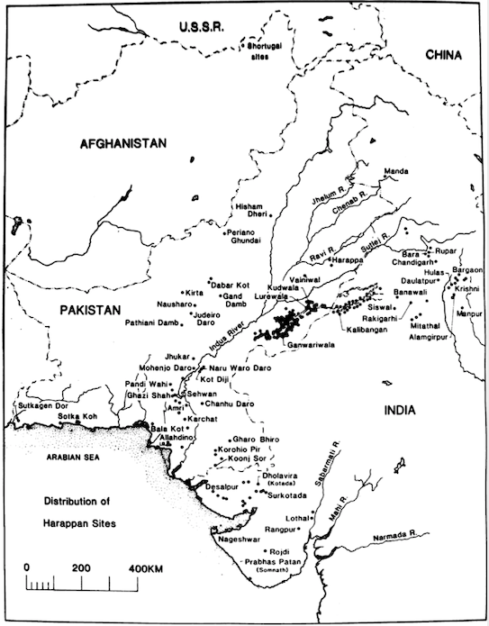
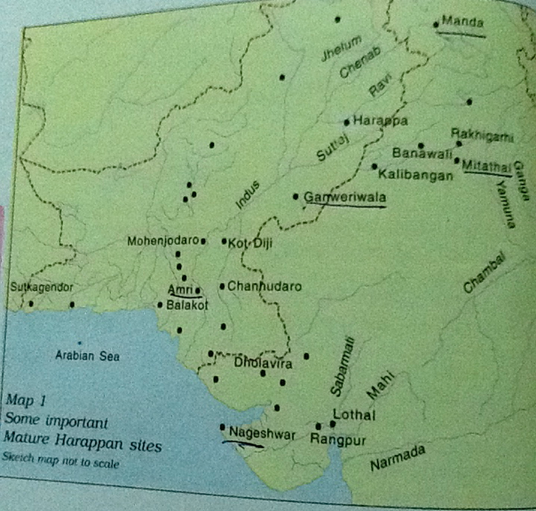

# Harappan Civilization

#### Beginning & End

###### New Study - Climatic Factors

1. This new study is by an international team which conducted survey of the various landforms made by Indus.
2. There was a gradual decline in monsoonal activity leading to decreased flood intensity, taming of rivers thus making cultivation and urbanization possible. Settlement began around Indus in 3200 BC.
3. However as the decline in rains continued it eventually led to area drying up, agricultural activity declining and eventual demise. River Ghagghar (ex Saraswati) that now flows only in intense rains used to be a perennial river back then and was supported by heavy monsoonal activities back then. The decline in rains dried it up. After about 600 years of flourishing urbanization, settlements began to shrink and shift in 2000 BC and move east and south east.

###### Aryan Invasion

1. The language of Aryans was shown to be similar to that prevailing in central Asia and its subsequent spread in N India was taken to be an indicator of a conquest. But languages can spread even without any invasions.
2. The skeletons of Mohenjodaro were taken to be a proof of Aryan invasion. But analysis shows most of these deaths were because of diseases like severe anaemia. Also violent deaths in a particular area doesn't mean any widespread invasion but could indicate a local disturbance also.
3. The Rig Veda refers to skirmishes between dasyus and aryans, dasas and aryans and among aryans. This indicates that groups of Aryans gradually migrated from Iran into Afghanistan and NW where they introduced the language. The way meanings of some terms are opposite in Vedas and in Avesta indicates that these migrants may be a dissident branch. When the Aryans reached Harappan towns, they had already declined.

###### What's in a name

1. The number of sites (in a region) don't matter but the crucial question is the importance of those sites in the civilization or the impetus they would have given to the development of the civilization. It is clear (from the spread of raw materials, availability of agricultural surplus, trade routes) that the sites in the Indus valley would be more likely to have given birth to urbanization than the sites located in Rajasthan or Cholistan. The development of urbanization in Gujarat is of a later and sudden origin which indicates movement of Harappan people from NW to there. Hence Indus Valley can be an appropriate name.

---

<a href="agricultural-pastoral-megalithic" class="prev-button">← Previous: Agricultural, Pastoral & Megalithic Cultures</a>          

<a href="vedic-age" class="next-button">Next: Vedic Age →</a>

