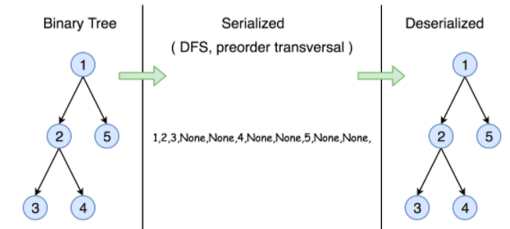

# Miscellaneous Coding Patterns Problems

Here are some interesting list of miscellaneous problems.

## 1. Trapping Rain Water Problem

###### Problem:

Given n non-negative integers representing an elevation map where the width of each bar is 1, compute how much water it is able to trap after raining.

> Example:
>
> Input: [0, 1, 0, 2, 1, 0, 1, 3, 2, 1, 2, 1]
>
> Output: 6

<br>

###### Approach-1: Calculate Right pole and Left pole in Advance

- Find left_pole and right_pol array for every element similar to finding leader in array.
- Then iterate over every element and find the water contributed by that particular element by **min(left_pole[i], right_pole[i]) - arr[i]**.

<br>

###### Implementation

**Code:**

```python
def trap(height):
    n = len(height)
    right_pole = [0]*n
    right_pole[n-1] = height[n-1]
    for i in range(n-2, -1, -1):
        right_pole[i] = max(right_pole[i+1], height[i])
        
    left_pole = [0]*n
    left_pole[0] = height[0]
    for i in range(1, n):
        left_pole[i] = max(left_pole[i-1], height[i])
        
    water = 0
    for i in range(n):
        water += min(left_pole[i], right_pole[i]) - height[i]
    
    return water
```

**Complexity:**

- ***Time: O(n)*** 
- ***Auxilliary Space: O(n)*** 

<br>

###### Approach-2: Use two pointer to track Left pole and Right pol

- Try to eliminate calculating left_pole and right_pole.
- Try doing in the one iteration only.

<br>

###### Implementation:

**Code:**

```python
def trap2(height):
    n = len(height)
    i = 0
    j = n-1
    left_max = 0
    right_max = 0
    water = 0
    while(i < j):
        if(height[i] < height[j]):
            left_max = max(left_max, height[i])
            water += left_max - height[i]
            i += 1
        else:
            right_max = max(right_max, height[j])
            water += right_max - height[j]
            j -= 1
    
    return water
```

**Complexity:**

- ***Time: O(n)*** 
- ***Auxilliary Space: O(1)*** 

<br>

<br>

## 2. Serialize and Deserialize Binary Tree

> **Serialization & Deserialization**
>
> It is the  process of converting a data structure or object into a sequence of bits so that it can be stored in a file or memory buffer, or transmitted  across a network connection link to be reconstructed (deserialized) later in the same  or another computer environment.

###### Problem:

Design an algorithm to serialize and deserialize a binary tree. There is no restriction on how your serialization/deserialization algorithm  should work. You just need to ensure that a binary tree can be  serialized to a string and this string can be deserialized to the  original tree structure.

###### Approach: Use DFS on Binary Tree

A simple solution is to store both Inorder and Preorder traversals. This solution requires requires space twice the size of Binary Tree.
We can save space by storing Preorder traversal and a marker for NULL pointers. 




**Other Examples:**


###### Implementation:

**Code:**

```python
class TreeNode(object):
    def __init__(self, x):
        self.val = x
        self.left = None
        self.right = None


class Codec:
    def serialize(self, root):
        serialized_btree = []
        self._modified_pre_order(root, serialized_btree)
        return ",".join(serialized_btree)

    def _modified_pre_order(self, root, serialized_btree):
        if root:
            serialized_btree.append(str(root.val))
            self._modified_pre_order(root.left, serialized_btree)
            self._modified_pre_order(root.right, serialized_btree)
        else:
            serialized_btree.append("#")

    def deserialize(self, data):
        nodes_list = data.split(",")
        nodes_list.reverse()
        return self._build_tree(nodes_list)

    def _build_tree(self, nodes_list):
        if not nodes_list:
            return

        key = nodes_list.pop()
        if key != "#":
            root = TreeNode(int(key))
            root.left = self._build_tree(nodes_list)
            root.right = self._build_tree(nodes_list)
            return root


def print_tree(root):
    if root:
        print(root.val, end=" ")
        print_tree(root.left)
        print_tree(root.right)


# Your Codec object will be instantiated and called as such:
#     1
#    / \
#   2   3
#      / \
#     4   5
#   /  \
#  7    6


root = TreeNode(1)
root.left = TreeNode(2)
root.right = TreeNode(3)
root.right.left = TreeNode(4)
root.right.right = TreeNode(5)
root.right.left.left = TreeNode(7)
root.right.left.right = TreeNode(6)

codec = Codec()
print_tree(codec.deserialize(codec.serialize(root)))
print()

#      20
#    /
#   8
#  / \
# 4  12
#   /  \
#  10  14

root = TreeNode(20)
root.left = TreeNode(8)
root.left.left = TreeNode(4)
root.left.right = TreeNode(12)
root.left.right.left = TreeNode(10)
root.left.right.right = TreeNode(14)

codec = Codec()
print_tree(codec.deserialize(codec.serialize(root)))
print()
```

**Output:**

```
1 2 3 4 7 6 5 
20 8 4 12 10 14 
```

**Complexity:**

- ***Time complexity: O(N)*** : In both serialization and deserialization functions, we visit each node exactly once, thus the time complexity is O(N), where N is the number of nodes, *i.e.* the size of tree.
- ***Space complexity: O(N)*** : In both serialization and deserialization functions, we keep the entire tree, either at the beginning or at the end, therefore, the space complexity is O(N).


