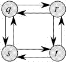

# Dynamic Programming Patterns

##### Dynamic Programming

- It is an algorithmic paradigm that solves a given complex problem by breaking it into subproblems and storing the results of subproblems to avoid computing the same results again. 
- Utilizes the fact that the optimal solution to the overall problem depends on the optimal solutions to its subproblems.
- ***Example:*** Fibonacci numbers - We can calculate nth Fibonacci by below eqution

```
fib(n) = fib(n-1) + fib(n-2) for n > 1
```

- Here to solve the overall problem we broke it down to smaller subproblems.

<br>

##### Characteristics of Dynamic Programming

[1. Overlapping Subproblems]()

- Subproblems are smaller version of the original problem.
- Any problem has overlappping subproblems if finding its solution involves solving the same subproblem multiple times.
- Like Divide and Conquer, Dynamic Programming combines solutions to sub-problems.
- Dynamic Programming is mainly used when solutions of same subproblems are needed again and again.
- In dynamic programming, computed solutions to subproblems are stored in a table so that these don’t have to be recomputed.
- Dynamic Programming is not useful when there are no common (overlapping) subproblems because there is no point storing the solutions if they are not needed again.
- **Binary Search** is broken down into subproblems but it doesn’t have common subproblems, so no sense to store the solutions.


- Here we can see overlapping subproblems as **fib(2)** is evaluated twice and **fib(1)** evaluated thrice.

<br>

[2. Optimal Substructure Property]()

- Any problem has optimal substructure property if its overall optimal solution can be constructed from optimal solution of subproblems.

- **`fib(n)= fib(n-1)+fib(n-2)`** - shows that overall problem of size ***n*** is reduced to subproblems of size ***n-1*** and ***n-2***.

- ***E******xample:-*** The Shortest Path problem has following optimal substructure property:

  - If a node x lies in the shortest path from a source node u to destination node v.
  - Then the shortest path from u to v is combination of shortest path from u to x and shortest path from x to v.
  - The standard All Pair Shortest Path algorithms like **Floyd–Warshall** and **Bellman–Ford** are typical examples of Dynamic Programming. 

- But the Longest Path problem i.e. longest simple path (path without cycle) between two nodes doesn’t have the Optimal Substructure property. 

  - There are two longest paths from q to t: q→r→t and q→s→t.
  - Unlike shortest paths, these longest paths do not have the optimal substructure property.
  - *Example:-* The longest path q→r→t is not a combination of longest path from q to r and longest path from r to t.
    - Coz the longest path from q to r is q→s→t→r and the longest path from r to t is r→q→s→t.

  


<br>

##### Methods to Solve Dynamic Programming Problem 

###### 1. Recursion + Memoization (Top-Down Approach)

- Solve bigger problem by recursiverly finding the solution to smaller sub-problems.
- ***Whenever we solve a sub-problem we cache its result to avoid calling it multiple times.***
- This technique of storing the results of already solved subproblems k/a [Memoization]().

###### 2. Iteration + Tabulation (Bottom-Up Approach)

- Tabulation is opposite of Top-Down Approach and avoids recursion.
- In this we solve the problem bottom up (i.e by solving all the related subproblems first).
- ***This is typically done by filling an n-dimensional table.***
- Based on the results in the table, the solution to the top/orignal problem is computed.


> [Notes :-]() 
>
> - Both Tabulated and Memoized store the solutions of subproblems.
> - In Memoized version, table is filled on demand but in Tabulated version, starting from the first entry, all entries are filled one by one.
> - Unlike the Tabulated version, all entries of the lookup table are not necessarily filled in Memoized version.
> - ***Example:-*** Memoized solutionof the LCS problem doesn’t necessarily fill all entries. 

<br>

<br>

### Patterns to be studied:

1. **Fibonacci Numbers Pattern**
2. **0/1 Knapsack Pattern**
3. **Unbounded Knapsack Pattern**
4. **Palindromic Subsequence Pattern**
5. **Longest Common Substring Pattern**


<br>

<br>

---

<a href="fibonacci-numbers-pattern" class="next-button">Next: Fibonacci Numbers Pattern &rarr;</a>

