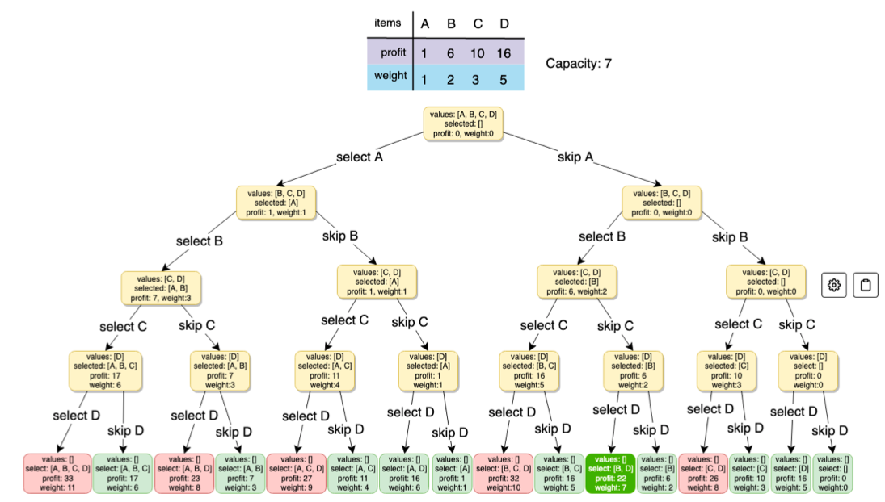
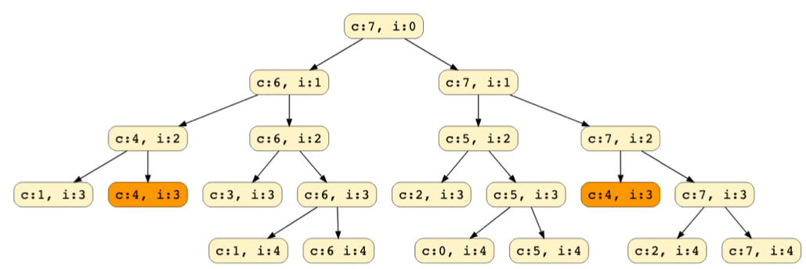
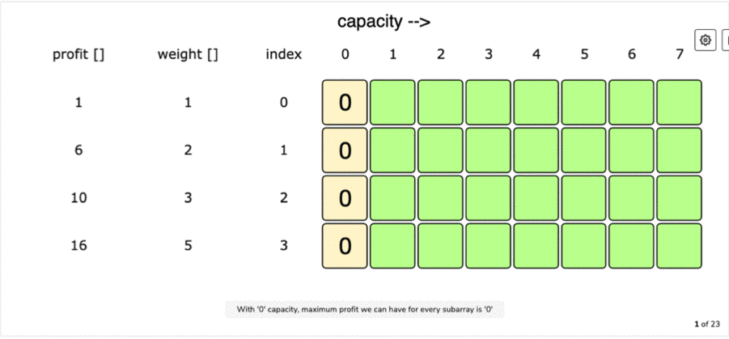
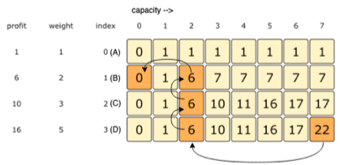

# 0/1 Knapsack Pattern

### Problems following 0/1 Knapsack Pattern

## 1. 0/1 Knapsack

###### Problem:

Given the weights ***w*** and profits ***p*** of 'N' items, need to find a subset of these items which will give max profit with contstraint that their cumulative sum should not be greater than total knapsack capacity ***C***.

Each item can only be selected only once and each item will be either taken (1) or skipped (0).

```
Example:
Items: {Apple, Orange, Banana, Melon}
Weights(w): {2, 3, 1, 4}
Profits(p): {4, 5, 3, 7}
Knapsack Capacity(C): 5

Answer: 10 - Banana + Melon with total weight 5
All other combinations with weight 5 or less has lesser profits.
```

<br>

###### Brute-Force : Recursive Solution

- Try out all possible combinations of items which has cumulative weight less than given capacity and then pick one with highest profit.
- For every item take 2 possiblities first with including this item (if weight constraint is fine) and second with excluding this item.
- Finally we can get the set with max profit following the capacity constriant.



**Code :**

```python
def solve_knapsack_recursion(profits, weights, capacity):
    item_index = 0
    return solve_knapsack_recursion_util(profits, weights, capacity, item_index)

def solve_knapsack_recursion_util(profits, weights, capacity, item_index):
    if (capacity <= 0 or item_index >= len(profits)):
        return 0

    profit1 = 0
    if (weights[item_index] <= capacity):  # can be included
        profit1 = profits[item_index] + solve_knapsack_recursion_util(profits, weights, 
        capacity-weights[item_index], item_index+1)
    
    profit2 = solve_knapsack_recursion_util(profits, weights, capacity, item_index+1)

    return max(profit1, profit2)


print("Recursive Method :")
print(solve_knapsack_recursion([1, 6, 10, 16], [1, 2, 3, 5], 7))
print(solve_knapsack_recursion([1, 6, 10, 16], [1, 2, 3, 5], 6))
```

**Output:**

```
Recursive Method :
22
17
```

**Complexity:**

- ***Time: O(2<sup>n</sup>)*** - Total no. of nodes we need to process is 2<sup>n</sup> + 2<sup>n</sup>-1.
- ***Space: O(n)***  - As we are going in depth first way at max n elements can be there in recursion stack 

<br>

> **Identifying the problem as DP:**

- Need to draw the recursive calls to see if there are any overlapping subproblems.
- In ***each recursive call, profits and weights array remain constant*** and only ***capacity and item index changes***.
- Drawing recursive calls with denoting index as ***i*** and capacity as ***c***.



- Here we see that overlapping sublproblems as **`c:4, i:3`** is repeating and hence can be solved using memoization.

<br>

###### DP : Recursion + Memoization (Top-Down) Solution

- As we can see that this has overlapping subproblems so we can use Memoization to solve this.

**Code:**

```python
def solve_knapsack_dp_memoization(profits, weights, capacity):
    memory = [[None]*(capacity+1) for i in range(len(profits))]
    item_index = 0
    return solve_knapsack_dp_memoization_util(profits, weights, capacity, item_index, memory)

def solve_knapsack_dp_memoization_util(profits, weights, capacity, item_index, memory):
    if (capacity <= 0 or item_index >= len(profits)):
        return 0
    
    if(memory[item_index][capacity]):
        return memory[item_index][capacity]
    
    profit1 = 0
    if (weights[item_index] <= capacity):  # can be included
        profit1 = profits[item_index] + solve_knapsack_dp_memoization_util(profits, weights, 
        capacity-weights[item_index], item_index+1, memory)

    profit2 = solve_knapsack_dp_memoization_util(profits, weights, capacity, item_index+1, memory)
    memory[item_index][capacity] = max(profit1, profit2)

    return memory[item_index][capacity]


print("\nDP -> Recursion + Memoization Method :")
print(solve_knapsack_dp_memoization([1, 6, 10, 16], [1, 2, 3, 5], 7))
print(solve_knapsack_dp_memoization([1, 6, 10, 16], [1, 2, 3, 5], 6))
```

**Output:**

```
DP -> Recursion + Memoization Method :
22
17
```

**Complexity:**

- ***Time: O(N\*C)*** 
  - As we have memoized results of all the subproblems, we can conclude that we will not have more than **N*C** subproblems.
- ***Space: O(N\*C)***
  - In the worst case we will have to store **N*C** subproblems and also **O(N)** for recursion call stack. Overall it's **O(N*C)**.

<br>

###### DP : Iteration + Tabulation (Bottom-Up) Solution

- Now we willl try to build table in bottom up fashion.
- Here we need to find the max profit for every subarray for every possible capacity.
- **table\[i][c]** will represent the max profit for capacity ***c*** from firs ***i*** items.
- For each item at index ***i*** (0<=i<items.length) and capacity ***c*** (0 <= c <= capacity) we have two options:
  1. ***Exclude the item at index i***, in this case the we will get the profit we get from **table\[i-1][c]**.
  2. ***Inlude the item at index i***, if its weight is not more than capacity, in this case we get profit that is **profits[i] + table\[i-1][c-weights[i]]**.
- Finally just get the max value from both the possbilities.

```python
table[i][c] = max(table[i-1][c], profits[i] + table[i-1][c-weights[i])
```



**Code:**

```python
def solve_knapsack_dp_tabulation(profits, weights, capacity):
    table = [[0]*(capacity+1) for i in range(len(profits))]

    # When capacity is zero then, none of the item can be selected
    for i in range(len(profits)):
        table[i][0] = 0
    
    # If we consider only first weight, we will take it if its weight is less than capacity
    for c in range(capacity+1):
        if(weights[0] <= c):
            table[0][c] = profits[0]
    
    # Now consider rest by taking max of 1) current item can be included 2) current item is excluded
    for i in range(1, len(profits)):
        for c in range(1, capacity+1):
            if(weights[i] <= c):
                table[i][c] = max(table[i-1][c], profits[i] + table[i-1][c-weights[i]])
            else:
                table[i][c] = table[i-1][c]
    
    return table[i][c]


print("\nDP -> Iteration + Tabulation Method :")
print(solve_knapsack_dp_tabulation([1, 6, 10, 16], [1, 2, 3, 5], 7))
print(solve_knapsack_dp_tabulation([1, 6, 10, 16], [1, 2, 3, 5], 6))
```

**Output:**

```
DP -> Iteration + Tabulation Method :
22
17
```

**Complexity:**

- ***Time: O(N\*C)***
- ***Space: O(N\*C)***


##### Finding Selected Items:



- Profit 22 did not come from top cell (which is 17), hence we must include this item (item D with profit 16 and weight 5).
- Now if 22 did not come from top cell it should have come from table\[i-1][c-weights[i] which is table\[2][2] with profit 6.
- Now this 6 is coming from top cell so we will not include this item, so we move to table\[1][2].
- Now this 6 is not coming from top cell so, we must include this item (item B with profit 6 and weight 2).
- Now it 6 did not come from top it would have come from table\[i-1][c-weights[i] which is table\[0][0] with profit 0.
- Once we hit zero profit we stop our picking.

**Code:**

```python
def solve_knapsack_dp_tabulation(profits, weights, capacity):
    table = [[-1]*(capacity+1) for _ in range(len(profits))]

    # When capacity is zero then, none of the item can be selected
    for i in range(len(profits)):
        table[i][0] = 0

    # If we consider only first weight, we will take it if its weight is less than capacity
    for c in range(capacity+1):
        if(weights[0] <= c):
            table[0][c] = profits[0]

    # Now consider rest by taking max of 1) current item can be included 2) current item is excluded
    for i in range(1, len(profits)):
        for c in range(1, capacity+1):
            if(weights[i] <= c):
                table[i][c] = max(table[i-1][c], profits[i] + table[i-1][c-weights[i]])
            else:
                table[i][c] = table[i-1][c]

    pick_selected_items(table, weights, profits)

    return table[i][c]


def pick_selected_items(table, weights, profits):
    i, c = len(table) - 1, len(table[0]) - 1
    total_profit = table[i][c]

    print("Selected items are : ")

    while(total_profit > 0 and i-1 >= 0):
        if(table[i][c] != table[i-1][c]):
            print(f"item - {i+1} with weight : {weights[i]} and total_profit : {profits[i]}")
            total_profit -= profits[i]
            c -= weights[i]
        i -= 1

    if total_profit != 0:
        print(f"item - {1} with weight : {weights[0]} and total_profit : {profits[0]}")


print("\nDP -> Iteration + Tabulation Method :")
print(solve_knapsack_dp_tabulation([1, 6, 10, 16], [1, 2, 3, 5], 7))
print(solve_knapsack_dp_tabulation([1, 6, 10, 16], [1, 2, 3, 5], 6))
```

**Output:**

```
DP -> Iteration + Tabulation Method :
Selected items are : 
item - 4 with weight : 5 and total_profit : 16
item - 2 with weight : 2 and total_profit : 6
22
Selected items are : 
item - 3 with weight : 3 and total_profit : 10
item - 2 with weight : 2 and total_profit : 6
item - 1 with weight : 1 and total_profit : 1
17
```

<br>

###### Solving in O(C) space :

- If we see closely, we need two values from the previous iteration **table[c]** and **table[c-weights[i]]**.
- Since our inner loop is iterating over **c: 0-->capacity** lets see how it will effect our required values.
  1. table[c] has not been overriden yet in this current iteration, so it should be fine.
  2. table[c-weights[i]] may have been overriden in this current iteration and hence can't be used in current iteration.
- To solve the problem in second case, we can change our inner loop to process in reverse direction **c: capacity-->0**, this will ensure whenever we change value in **table[]**, we will not need it anymore in current iteration.

**Code:**

```python
def solve_knapsack_dp_tabulation_optimized_space(profits, weights, capacity):
    table = [0]*(capacity+1)
    
    # If we consider only first weight, we will take it if its weight is less than capacity
    for c in range(capacity+1):
        if(weights[0] <= c):
            table[c] = profits[0]
    
    # Now consider rest by taking max of 1) current item can be included 2) current item is excluded
    for i in range(1, len(profits)):
        for c in range(capacity, -1, -1):
            if(weights[i] <= c):
                table[c] = max(table[c], profits[i] + table[c-weights[i]])
            else:
                table[c] = table[c]
    
    return table[capacity]


print("\nDP -> Iteration + Tabulation - Optimized Space Method :")
print(solve_knapsack_dp_tabulation_optimized_space([1, 6, 10, 16], [1, 2, 3, 5], 7))
print(solve_knapsack_dp_tabulation_optimized_space([1, 6, 10, 16], [1, 2, 3, 5], 6))
```

**Output:**

```
DP -> Iteration + Tabulation - Optimized Space Method :
22
17
```

**Complexity:**

- ***Time: O(N\*C)***
- ***Space: O(C)***

<br>

<br>

## 2. Equal Subset Sum Partition

###### Problem:


<br>

<br>

## 3. Subset Sum

###### Problem:


<br>

<br>

## 4. Minimum Subset Sum Difference

###### Problem:


<br>

<br>

## 5. Count of Subset Sum

###### Problem:


<br>

<br>

## 6. Target Sum

###### Problem:


<br>

<br>

---

<a href="introduction" class="prev-button">&larr; Previous: Introduction</a> 

<a href="unbounded-knapsack-pattern" class="next-button">Next: Unbounded Knapsack Pattern &rarr;</a>


