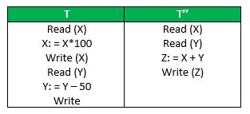

# Database Management

## Acid Properties

The ACID properties, in totality, provide a mechanism to ensure correctness and consistency of a database in a way such that each transaction is a group of operations that acts a single unit, produces consistent results, acts in isolation from other operations and updates that it makes are durably stored.

###### **Transaction:**

- A transaction is a single logical unit of work which accesses and possibly modifies the contents of a database.
- Transactions access data using read and write operations.
- In order to maintain consistency in a database, before and after transaction, certain properties are followed, they are called **ACID** **properties.**

#### Atomicity

- By this, we mean that either the entire transaction takes place at once or doesn’t happen at all.
- There is no midway i.e. transactions do not occur partially.
- Each transaction is considered as one unit and either runs to completion or is not executed at all.
- It involves following **two operations**. 
  - **Abort:** If a transaction aborts, changes made to database are not visible.
  - **Commit:** If a transaction commits, changes made are visible.
- Atomicity is also known as the ***`All or nothing rule`***.

> Consider the following transaction T consisting of T1 and T2: Transfer of 100 from account X to account Y.

- If the transaction fails after completion of T1 but before completion of T2( say, after write(X) but before write(Y)), then amount has been deducted from X but not added to Y. 

- This results in an inconsistent database state. Therefore, the transaction must be executed in entirety in order to ensure correctness of database state.

#### Consistency

- This means that integrity constraints must be maintained so that the database is consistent before and after the transaction.
- It refers to correctness of a database.
- Referring to the example above:
  - The total amount before and after the transaction must be maintained.
  - Total before T occurs = 500 + 200 = 700.
  - Total after T occurs = 400 + 300 = 700.
  - Therefore, database is consistent.
  - Inconsistency occurs in case T1 completes but T2 fails.
  - As a result T is incomplete.

#### Isolation

- This property ensures that multiple transactions can occur concurrently without leading to inconsistency of database state.
- Transactions occur independently without interference.
- Changes occurring in a particular transaction will not be visible to any other transaction until that particular change in that transaction is written to memory or has been committed.
- This property ensures that the execution of transactions concurrently will result in a state that is equivalent to a state achieved these were executed serially in some order.

>  Let X= 500, Y = 500.  and Consider two transactions **T** and **T"**.

- Suppose **T** has been executed till Read (Y) and then **T"** starts.

- As a result , interleaving of operations takes place due to which **T"** reads correct value of X but incorrect value of Y and sum computed

  > **T": (X+Y = 50, 000+500=50, 500)** 
  >
  > is thus not consistent with the sum at end of transaction:
  >
  > **T: (X+Y = 50, 000 + 450 = 50, 450)**
  >
  > This results in database inconsistency, due to a loss of 50 units. 

- Hence, **transactions must take place in isolation** and changes should be visible only after a they have been made to the main memory.

#### Durability

- This property ensures that once the transaction has completed execution.
- The updates and modifications to the database are stored in and written to disk and they persist even is system failure occurs.
- These updates now become permanent and are stored in a non-volatile memory.
- The effects of the transaction, thus, are never lost.

## Normalization

Normalization

## RAID

Redundant Array of Independent Disks

