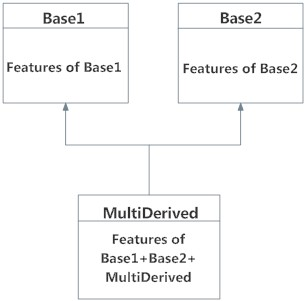
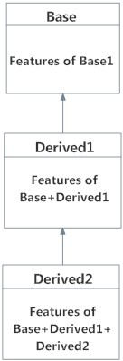

# Object Oriennted Programming

###### What is Object Oriented Programming?

- Object-oriented Programming is a **programming paradigm.** 
- It provides means of structuring programs so that properties and behaviors are bundled into individual objects.
- Python is a multi-paradigm (functional, object-oriented) programming language i.e it supports different programming approach.
- We can choose the paradigm that best suits the problem at hand, mix different paradigms in one program, and/or switch from one paradigm to another as the program evolves.

##### Major principles of object-oriented programming system are:

- Classes, Objects (Instances), Methods

- Inheritance

- Polymorphism

- Encapsulation (Data Abstraction)

    

> **Advantages of object oriented programming:**

1. **Improved software-development productivity:** 

    - Provides improved software-development productivity over traditional procedure-based programming techniques due to below factors.
        1. **Modularity:** Provides separation of duties in object-based program development.
        2. **Extensibility:** Objects can be extended to include new attributes and behaviors.
        3. **Reusability:** Objects can also be reused within an across applications.

2. **Improved software maintainability:**

    - For the reasons mentioned above, it is easier to maintain.

    - Since the design is modular, part of the system can be updated in case of issues without a need to make large-scale changes.

3. **Faster development:**

    - Reuse enables faster development.

    - Come with rich libraries of objects, and code developed during projects is also reusable in future projects.

4. **Lower cost of development:**

    - Typically, more effort is put into the object-oriented analysis and design, which lowers the overall cost of development.

5. **Higher-quality software:**

    - Faster development of software and lower cost of development allows more time and resources to be used in the verification of the software.

    - Although quality is dependent upon the experience of the teams, it tends to result in higher-quality software.


> **Disadvantages of object oriented programming:**

- **Steep learning curve:**
    - The thought process involved may not be natural for some people, and it can take time to get used to it.
    - It is complex to create programs based on interaction of objects.
    - Some of the key programming techniques, such as inheritance and polymorphism, can be challenging to comprehend initially
- **Larger program size:**
    - Typically involve more lines of code than procedural programs.
- **Slower programs:**
    - Typically slower than procedural programs, as they typically require more instructions to be executed.
- **Not suitable for all types of problems:**
    - There are problems that lend themselves well to functional-programming style, logic-programming style, or procedure-based programming style.
    - Applying object-oriented programming in those situations will not result in efficient programs.

###### Example of Python Class:

```python
class Dog:
    species = 'mammal'
    legs = 4
    
    def __init__(self, name, age):
        self.name = name
        self.age = age
        
    def description(self):
        print("{} is {} years old".format(self.name, self.age))
        
    def bark(self):
        print("Bhaun.. Bhaun..")

        
dog_a = Dog("Roger", 8)
dog_b = Dog("Lysa", 5)
dog_a.description() 
dog_a.bark()

## Output: ##
# Roger is 8 years old.
# Bhaun.. Bhaun..
```

### Classes

- A class is a blueprint for the object.
- It’s an idea or imagination about an object i.e what are its properties and what are its behaviours.
- When class is defined, only the description for the object is defined and hence no memory or storage is allocated.
- Example:- ***Dog*** 
- **Class Attributes (Variables):**
    - Variables or attributes that are shared by all instances of a class.
    - Example:- ***species, legs*** 

### Objects(Instances)

- An object (instance) is an instantiation of a class.
- It’s not an idea anymore; it’s an actual object like a dog named Roger who’s eight years old.
- Example:- ***dog_a, dog_b*** 
- **Instance** **Attributes (Variables):**
    - All classes create objects, and all objects contain characteristics called attributes (properties).
    - Example:- ***name, age***

### Methods

- Methods are functions defined inside the body of a class.
- They can also have their own variables.
- They are used either to get, set or modify the contents of an instance or to define the behaviors of an object.
- Example:- ***description, bark***


## Inheritance

- Inheritance is the process by which one class takes on the attributes and methods of another.
- Newly formed classes are called child classes, and the classes that child classes are derived from are called parent classes.
- It provides re-usability of the code.

```python
# parent class
class Bird:
    def __init__(self):
        print("Bird is ready")
        
    def whoisThis(self):
        print("Bird")
        
    def swim(self):
        print("Swim faster")

        
# child class
class Penguin(Bird):
    def __init__(self):
        # call super() function
        super().__init__()
        print("Penguin is ready")
        
    def whoisThis(self):
        print("Penguin")
        
    def run(self):
        print("Run faster")

peggy = Penguin()
peggy.whoisThis()
peggy.swim()
peggy.run()


## Output ##
# Bird is ready
# Penguin is ready
# Penguin
# Swim faster
# Run faster
```

##### Note:

We used **`super( )`** function before **`__init__( )`** method. 

This is because we want to pull the content of **`__init__( )`** method from the parent class into the child class.

#### Multi-Inheritance

###### Multi-ple Inheritance

- In multiple inheritance, the features of all the base classes are inherited into the derived class.

```python
class Base1:
    pass
 
class Base2:
    pass
  
class MultiDerived(Base1, Base2):
    pass
```



###### Multi-level Inheritance

- We can also inherit form a derived class k/a multilevel inheritance and it can be of any depth in Python.
- In multilevel inheritance, features of the base class and the derived class is inherited into the new derived class.

```python
class Base:
    pass
  
class Derived1(Base):
    pass
  
class Derived2(Derived1):
    pass
```




> **Method Resolution Mechanism:**

- In the multiple inheritance scenario, any specified attribute is searched first in the current class.
- If not found, the search continues into parent classes in depth-first, left-right fashion without searching same class twice.
- So, in the above example of MultiDerived class the search order is [MultiDerived, Base1, Base2, object].
- This order is also called linearization of MultiDerived class and the set of rules used to find this order is called **Method Resolution Order (MRO)**. 
- MRO must prevent local precedence ordering and also provide monotonicity.
- It ensures that a class always appears before its parents and in case of multiple parents, the order is same as tuple of base classes.
- MRO of a class can be viewed as the **__mro__** attribute or **mro( )** method. The former returns a tuple while latter returns a list.

##### Output:

```bash
>>> MultiDerived.__mro__
(<class '__main__.MultiDerived'>,
 <class '__main__.Base1'>,
 <class '__main__.Base2'>,
 <class 'object'>)

>>> MultiDerived.mro()
[<class '__main__.MultiDerived'>,
 <class '__main__.Base1'>,
 <class '__main__.Base2'>,
 <class 'object'>]
```

###### Complex Example

```python
class X: pass
class Y: pass
class Z: pass

class A(X,Y): pass
class B(Y,Z): pass
class M(B,A,Z): pass

print(M.mro())
```

**Output:**

```bash
[<class '__main__.M'>, <class '__main__.B'>,
 <class '__main__.A'>, <class '__main__.X'>,
 <class '__main__.Y'>, <class '__main__.Z'>,
 <class 'object’>]
```


## Polymorphism

Polymorphism is considered as one of the important features of Object Oriented Programming.

**Polymorphism is mainly divided into two types:**

1. Compile time Polymorphism
2. Runtime Polymorphism

### Compile time Polymorphism

This type of polymorphism is achieved by:

- Function/Method Overloading
- Operator Overloading

#### Function/Method Overloading

- When there are multiple functions with same name but different parameters then these functions are said to be overloaded.
- Functions can be overloaded by change in number of arguments or/and change in type of arguments.
- **Python does not supports method overloading. We may overload the methods but can only use the latest defined method.**

```python
# First product method: takes 2 argument and print their product
def product(a, b):
    p = a * b
    print(p)
    
# Second product method: takes 3 argument and print their product
def product(a, b, c):
    p = a * b*c
    print(p)

    
# Below line shows an error
product(4, 5)
# => Gives error

# This line will call the second product method
product(4, 5, 5)
#=> 100
```

- **We can overload the function in a different way**.

```python
class Human:
    def sayHello(self, name=None):
        if name is not None:
            print 'Hello ' + name
        else:
            print 'Hello '

# Create instance
obj = Human()

# Call the method
obj.sayHello()
# => Hello

# Call the method with a parameter
obj.sayHello('Astik')
# => Hello Astik
```

- In the above example, a single function named sayHello( ) acts differently in 2 different situations which is the property of polymorphism.

#### Operator Overloading

- There is also an option to overload operators.
- For example, we can make the operator **`+`** for string class to concatenate two strings.
- We know that this is the addition operator whose task is to add to operands.
- So a single operator **`+`** when placed between integer operands , adds them and when placed between string operands, concatenates them.

```python
import math
class Circle:
    def __init__(self, radius):
        self.__radius = radius
        
    def setRadius(self, radius):
        self.__radius = radius
        
    def getRadius(self):
        return self.__radius
      
    def area(self):
        return math.pi * self.__radius ** 2
      
    def __add__(self, another_circle):
        return Circle( self.__radius + another_circle.__radius )
      
    def __gt__(self, another_circle):
        return self.__radius > another_circle.__radius
      
    def __lt__(self, another_circle):
        return self.__radius < another_circle.__radius
      
    def __str__(self):
        return "Circle with radius " + str(self.__radius)

      
c1 = Circle(4)
print(c1.getRadius())
c2 = Circle(5)
print(c2.getRadius())
c3 = c1 + c2
print(c3.getRadius())
print( c3 > c2) # Became possible because we have added __gt__ method
print( c1 < c2) # Became possible because we have added __lt__ method
print(c3) # Became possible because we have added __str__ method
```

**Output:**

```
4
5
9
True
True
Circle with radius 9
```


### Run Time Polymorphism

This type of polymorphism is achieved by:

- Method Overriding

#### Method Overriding

- Function overriding occurs when a derived class has a definition for one of the member functions of the base class.
- That base function is said to be overridden.

```python
class Rectangle():
    def __init__(self, length, breadth):
        self.length = length
        self.breadth = breadth
        
    def getArea(self):
        print self.length*self.breadth," is area of rectangle"

        
class Square(Rectangle):
    def __init__(self, side):
        self.side = side
        Rectangle.__init__(self,side,side)
    def getArea(self):
        print self.side*self.side," is area of square"

        
s = Square(4)
r = Rectangle(2,4)
s.getArea()
r.getArea()
```

**Output:**

```
16
16
```


## Encapsulation (Data Abstraction)

- We can restrict access to methods and variables.
- Prevents data from direct modification which is called encapsulation.
- In Python, we denote private attribute using underscore as prefix i.e single **`_`**  or double **`__`**.

```python
class Computer:
    def __init__(self):
        self.__maxprice = 900
        
    def sell(self):
        print("Selling Price: {}".format(self.__maxprice))
        
    def setMaxPrice(self, price):
        self.__maxprice = price

        
c = Computer()
c.sell()

# change the price
c.__maxprice = 1000
c.sell()

# using setter function
c.setMaxPrice(1000)
c.sell()
```

**Output:**

```
Selling Price: 900
Selling Price: 900
Selling Price: 1000
```

